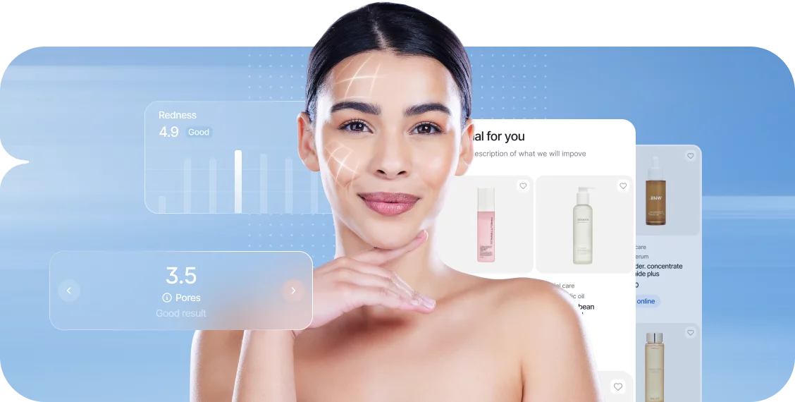

# GlowGuide: AI-Powered Skin Type Analyzer & Product Recommender



## 🌟 What is GlowGuide?

**GlowGuide** is an AI-powered web application that analyzes your skin type from an uploaded image and provides personalized skincare product recommendations. Built by a team of passionate students, making it easy for anyone to find products that truly suit their skin.

---

## 🚀 Features

- **AI Skin Type Detection:** Upload a photo of your skin and get instant analysis (Oily/Dry, Sensitive/Resistant, Pigmented/Non-pigmented).
- **Personalized Recommendations:** Receive tailored product suggestions based on your unique skin type.
- **Modern Frontend:** User-friendly interface built with HTML, CSS, and JavaScript.
- **FastAPI Backend:** Robust Python backend for image processing and ML inference.


## ⚡ Setup Instructions

### 1. **Clone the repository**

```sh
git clone https://github.com/yourusername/glowguide.git
cd glowguide
```

### 2. **Backend Setup (Python, FastAPI)**

- **Create a virtual environment:**
  ```sh
  cd SkinTypeClassification
  python -m venv venv
  venv\Scripts\activate
  ```

- **Install dependencies:**
  ```sh
  pip install -r requirements.txt
  uvicorn app:app --reload
  ```

- **Run the FastAPI server:**
  ```sh
  uvicorn app:app --reload
  ```
  The backend will be available at `http://localhost:8000`.

### 3. **Frontend Setup**

- Open `Frontend/index.html` in your web browser.
- The frontend will communicate with the backend at `http://localhost:8000`.

---

## ⚡ Important Notice

```sh
  Ensure that oily_dry_model.h5, pigmented_nonpigmented_model.h5 and sensitive_resitant_model.h5 are present in SkinTypeClassification/app/models

```
---

## 👨‍💻 Contributors

See [Frontend/about.html](Frontend/about.html) for the full team!

---

## 📄 License

This project is for educational purposes.

---

## 💡 Inspiration

What began as a classroom idea is now a platform empowering users to make informed skincare choices. We’re excited to keep improving and expanding GlowGuide!
